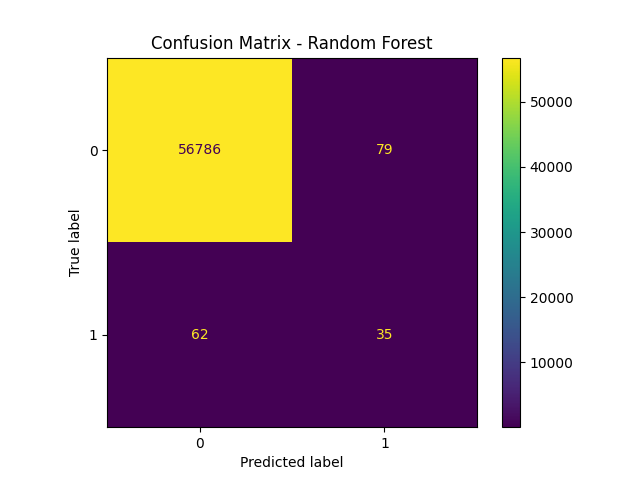
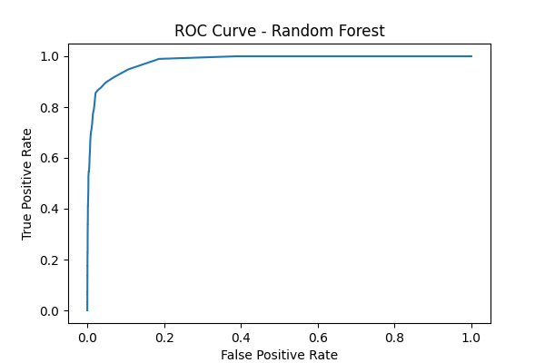

# Credit Card Fraud Detection

Machine Learning project to detect fraudulent credit card transactions using Logistic Regression and Random Forest.

---

## Overview
This project detects fraudulent credit card transactions using Machine Learning.

## Models Used
- Logistic Regression
- Random Forest

## Features

- Data preprocessing
- Handling imbalanced datasets
- SMOTE oversampling
- Logistic Regression
- Random Forest
- Cross-validation
- ROC-AUC evaluation
- Threshold tuning
- Feature importance analysis
- Logistic Regression
- Random Forest
- SMOTE
- Confusion Matrix
- Streamlit App

---

## Technologies Used

- Python
- NumPy
- Pandas
- Scikit-learn
- Imbalanced-learn

---

## Dataset

Supports:
- Kaggle Credit Card Fraud Detection dataset
- Synthetic generated dataset

Dataset columns:
- Time
- V1 to V28
- Amount
- Class

---
## Results

Recommended Model: Random Forest
ROC-AUC: 0.9816

## Project Structure

- fraud_detection.py
- app.py
- fraud_model.pkl
- confusion_matrix_Logistic_Regression.png
- confusion_matrix_Random_Forest.png
- roc_curve_Logistic_Regression.png
- roc_curve_Random_Forest.png

## Visualizations




## Installation

```bash
pip install -r requirements.txt

